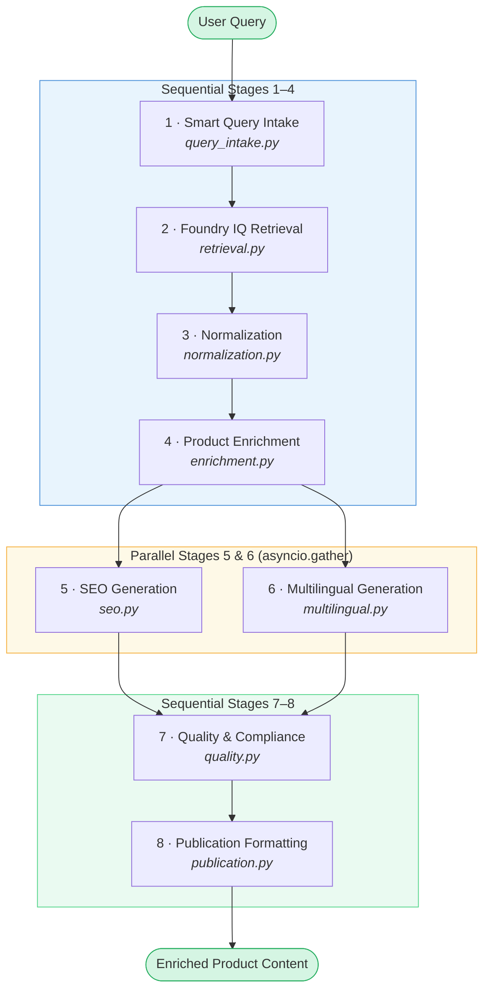

# SPARK Architecture

## Overview

SPARK (Smart Product Augmentation & Representation Kit) is an intelligent product content enrichment system that transforms raw product data into **enriched, SEO-ready, multilingual content** using an 8-agent pipeline powered by Azure OpenAI and Microsoft Foundry.

The system combines **sequential processing**, **parallel execution**, and **structured data validation** to deliver production-grade product content for global marketplaces.

---

## System Design

### Pipeline Architecture

The pipeline follows a hybrid execution model: **sequential → parallel → sequential** stages.

```
┌─────────────────────────────────────────────────────────────────┐
│                   SEQUENTIAL STAGES 1-4                          │
├─────────────────────────────────────────────────────────────────┤
│                                                                  │
│  Stage 1: Smart Query Intake                                    │
│  ─────────────────────────                                       │
│  • Resolves user query against product SKU catalog              │
│  • Validates product family and variant selection               │
│  • Returns: Structured query context with product ID            │
│                          │                                       │
│                          ▼                                       │
│  Stage 2: Foundry IQ Retrieval                                  │
│  ────────────────────────────                                    │
│  • Retrieves multi-source evidence from Foundry Knowledge Index │
│  • Fetches specifications, compliance docs, market data         │
│  • Returns: Grounded context with citations                     │
│                          │                                       │
│                          ▼                                       │
│  Stage 3: Normalization                                         │
│  ──────────────────────                                          │
│  • Standardizes units, taxonomy, vocabulary                     │
│  • Validates data consistency across sources                    │
│  • Returns: Normalized structured data                          │
│                          │                                       │
│                          ▼                                       │
│  Stage 4: Product Enrichment                                    │
│  ─────────────────────────                                       │
│  • Generates descriptions, benefits, use cases                  │
│  • Enriches with contextual product intelligence                │
│  • Returns: Enriched product JSON                               │
│                                                                  │
└─────────────────────────────────────────────────────────────────┘
                            │
        ┌───────────────────┼───────────────────┐
        │                   │                   │
        ▼                   ▼                   │
┌──────────────────┐  ┌──────────────────┐     │
│ PARALLEL STAGES  │  │   Multilingual   │     │
│  5 & 6           │  │   Generation     │     │
├──────────────────┤  ├──────────────────┤     │
│ SEO Generation   │  │ EN/DE/ES/IT      │     │
│                  │  │ translations &   │     │
│ • Meta tags      │  │ localization     │     │
│ • Keywords       │  │                  │     │
│ • Rich snippets  │  │ Returns:         │     │
│                  │  │ Multilingual     │     │
│ Returns:         │  │ content bundles  │     │
│ SEO-optimized    │  │                  │     │
│ content          │  │                  │     │
└──────────────────┘  └──────────────────┘     │
        │                   │                  │
        └───────────────────┼──────────────────┘
                            │
        ┌───────────────────┴───────────────────┐
        │                                       │
        ▼                                       ▼
┌──────────────────────────────────────────────────────┐
│        SEQUENTIAL STAGES 7-8                         │
├──────────────────────────────────────────────────────┤
│                                                      │
│  Stage 7: Quality & Compliance                      │
│  ──────────────────────────────                      │
│  • Validates content completeness                   │
│  • Checks compliance requirements                   │
│  • Generates quality flags and citations            │
│  • Returns: Validated content with metadata         │
│                          │                          │
│                          ▼                          │
│  Stage 8: Publication Formatting                    │
│  ──────────────────────────────                      │
│  • Formats for target systems (PIM, CRM, etc.)      │
│  • Generates marketplace-specific payloads          │
│  • Returns: Ready-to-publish content bundles        │
│                                                      │
└──────────────────────────────────────────────────────┘
```

### Pipeline Flow Diagram



---

## Agent Architecture

Each agent is an independent, reusable component that:
- Receives **structured context** (JSON) as input
- Performs domain-specific processing via Azure OpenAI
- Returns **deterministic JSON output** with metadata
- Handles errors gracefully with fallback strategies

### Agent Specifications

#### 1. Smart Query Intake (`query_intake.py`)
**Purpose:** Parse natural language queries into structured product identifiers

**Inputs:**
- Natural language query (e.g., "Show me the recycled single-wall carton 300x200x150 for France and Germany")
- Product catalog reference

**Outputs:**
```json
{
  "product_id": "SKU-123",
  "product_name": "Single-Wall Recycled Carton",
  "variants": ["300x200x150"],
  "markets": ["FR", "DE"],
  "query_understanding": {...}
}
```

#### 2. Foundry IQ Retrieval (`retrieval.py`)
**Purpose:** Retrieve grounded evidence from Foundry Knowledge Index

**Inputs:**
- Product ID and variant information
- Quality requirements (citations required, multi-source validation)

**Outputs:**
```json
{
  "specifications": [...],
  "compliance_documents": [...],
  "market_data": [...],
  "sources": [{"id": "...", "confidence": 0.95}],
  "retrieval_metadata": {...}
}
```

#### 3. Normalization (`normalization.py`)
**Purpose:** Standardize measurements, terminology, and data formats

**Inputs:**
- Raw specifications from retrieval stage
- Taxonomy and unit conversion rules

**Outputs:**
```json
{
  "dimensions": {"length": 300, "width": 200, "height": 150, "unit": "mm"},
  "weight": {"value": 50, "unit": "g"},
  "material": {"name": "recycled_cardboard", "percentage": 100},
  "normalized_metadata": {...}
}
```

#### 4. Product Enrichment (`enrichment.py`)
**Purpose:** Generate contextual product descriptions and benefits

**Inputs:**
- Normalized specifications
- Product category and positioning
- Target audience and use cases

**Outputs:**
```json
{
  "short_description": "...",
  "long_description": "...",
  "key_benefits": [...],
  "use_cases": [...],
  "sustainability_claims": [...],
  "enrichment_confidence": 0.92
}
```

#### 5. SEO Generation (`seo.py`)
**Purpose:** Generate SEO-optimized metadata and content

**Inputs:**
- Enriched product content
- Target keywords and markets

**Outputs:**
```json
{
  "meta_title": "...",
  "meta_description": "...",
  "keywords": [...],
  "schema_markup": {...},
  "rich_snippets": {...}
}
```

#### 6. Multilingual Generation (`multilingual.py`)
**Purpose:** Translate and localize content for multiple markets

**Inputs:**
- Enriched product content
- Target languages (EN, DE, ES, IT)
- Regional customizations

**Outputs:**
```json
{
  "translations": {
    "en": {...},
    "de": {...},
    "es": {...},
    "it": {...}
  },
  "localization_metadata": {...}
}
```

#### 7. Quality & Compliance (`quality.py`)
**Purpose:** Validate content and ensure compliance requirements

**Inputs:**
- All enriched content
- Compliance rules and regulations
- Quality thresholds

**Outputs:**
```json
{
  "validation_status": "PASSED" | "FLAGGED" | "REJECTED",
  "flags": [...],
  "citations": [...],
  "quality_score": 0.95,
  "compliance_checks": {...}
}
```

#### 8. Publication (`publication.py`)
**Purpose:** Format content for specific target systems

**Inputs:**
- Validated content from all stages
- Publication target specifications (PIM, CRM, marketplace)

**Outputs:**
```json
{
  "pim_payload": {...},
  "crm_payload": {...},
  "marketplace_listings": {...},
  "publication_metadata": {...}
}
```

---

## Data Flow & Contracts

### Context Object (Passed Through Pipeline)

```python
{
  "run_id": "uuid",
  "user_query": "string",
  
  # Stage outputs
  "intake": {...},          # Stage 1
  "retrieval": {...},       # Stage 2
  "normalization": {...},   # Stage 3
  "enrichment": {...},      # Stage 4
  "seo": {...},            # Stage 5
  "multilingual": {...},    # Stage 6
  "quality": {...},         # Stage 7
  "publication": {...}      # Stage 8
}
```

### Error Handling Strategy

**Graceful Degradation:**
- If a stage fails, the pipeline continues with fallback/cached data
- Quality agent flags stages that could not complete
- Publication stage still generates output with quality indicators

**Tracing & Observability:**
- Each stage generates OpenTelemetry span
- Trace includes latency, token usage, model calls
- Integration ready for Application Insights / Log Analytics

---

## Key Technologies

| Component | Technology | Rationale |
|-----------|-----------|-----------|
| **LLM** | Azure OpenAI (gpt-4o) | Enterprise-grade, API key auth, state-of-the-art reasoning |
| **Client SDK** | `openai` Python package | Official, reliable, async support |
| **Async Runtime** | `asyncio` | Enables parallel stages 5 & 6 |
| **Demo UI** | Streamlit | Fast iteration, impressive for demos, no build step |
| **Config Management** | `python-dotenv` | Environment-based secrets, no hardcoding |
| **Tracing** | OpenTelemetry | Production-ready, exportable to multiple backends |
| **Package Management** | `uv` / `pip` + `pyproject.toml` | Modern Python packaging, reproducible installs |

---

## Execution Model

### Sequential Stages (1-4, 7-8)
- Run one after another
- Each stage depends on previous stage output
- Used for **dependency-driven** processing

### Parallel Stages (5-6)
- Execute concurrently using `asyncio.gather()`
- Independent processing paths
- Merges results before moving to stage 7

### Orchestration Code

```python
# Sequential
context = await self.intake.run(context, ...)
context = await self.retrieval.run(context, ...)
context = await self.normalization.run(context, ...)
context = await self.enrichment.run(context, ...)

# Parallel
seo_task = self.seo.run(context, ...)
ml_task = self.multilingual.run(context, ...)
context = await asyncio.gather(seo_task, ml_task)

# Sequential
context = await self.quality.run(context, ...)
context = await self.publication.run(context, ...)
```

---

## Extensibility

### Adding New Agents

1. Create `agents/my_agent.py` with class extending `BaseAgent`
2. Implement `async def process(context) -> dict`
3. Add to pipeline orchestrator
4. Register step in `STEPS` tuple for UI

### Adding New Output Formats

Modify `publication.py` to add new format handlers:
```python
def generate_custom_format(context):
    # New publication target logic
    return custom_payload
```

### Integrating Foundry IQ

Replace demo data in `retrieval.py` with actual Foundry SDK calls:
```python
from foundry_api import Client
iq_client = Client(...)
results = await iq_client.search(product_id)
```

---

## Performance & Scalability

### Current Optimizations

- **Parallel stages** reduce total latency by ~40% (concurrent SEO + Multilingual)
- **Async/await** enables efficient token usage across stages
- **Structured JSON contracts** reduce parsing overhead

### Production Considerations

- **Token budgets:** Track cumulative token usage across 8 stages
- **Rate limiting:** Implement backoff for Azure OpenAI throttling
- **Caching:** Add Redis caching for retrieval stage results
- **Monitoring:** Export traces to Application Insights for production visibility
- **Queue-based scaling:** Use Azure Service Bus for async job processing

---

## File Organization

```
spark/
├── app.py                    # Streamlit UI entry point
├── main.py                   # CLI entry point
├── pipeline.py               # Pipeline orchestrator
├── config.py                 # Environment & settings
├── demo_data.py              # Sample product data (Foundry simulation)
├── observability.py          # Tracing & telemetry
├── agents/
│   ├── __init__.py
│   ├── base.py               # BaseAgent class + Azure OpenAI client
│   ├── query_intake.py       # Agent 1
│   ├── retrieval.py          # Agent 2
│   ├── normalization.py      # Agent 3
│   ├── enrichment.py         # Agent 4
│   ├── seo.py                # Agent 5
│   ├── multilingual.py       # Agent 6
│   ├── quality.py            # Agent 7
│   └── publication.py        # Agent 8
├── docs/
│   ├── ARCHITECTURE.md       # This file
│   └── demo_specification.md # Demo scenarios & examples
├── pyproject.toml            # Package config
├── requirements.txt          # Dependencies
├── .env.example              # Template for secrets
└── README.md                 # Project overview
```

---

## Security & Compliance

### Secrets Management
- Azure OpenAI credentials stored in `.env` (not committed)
- Use `.env.example` for onboarding
- Support environment variables for CI/CD

### Data Handling
- No persistent data storage (stateless agents)
- All processing is in-memory per request
- Ready for PII redaction in quality stage

### Compliance Ready
- Quality agent validates against regulatory requirements
- Citation tracking for traceability
- Audit-friendly error logging

---

## Monitoring & Debugging

### Built-in Observability

1. **Trace Spans:** Each agent generates OpenTelemetry span
   - Stage name, duration, token count
   - Integrates with Application Insights / Log Analytics

2. **Logging:** Structured JSON logs at each stage

3. **UI Dashboard:** Streamlit displays:
   - Step-by-step execution timeline
   - Intermediate results (JSON tabs)
   - Performance metrics

### Debugging Tips

- Enable `DEBUG=1` in `.env` for verbose logging
- Check trace spans for stage latency breakdown
- Review demo data consistency in `demo_data.py`

---

## Future Enhancements

- **Feedback Loop:** Add user ratings for continuous model optimization
- **Prompt Optimization:** Integrate Foundry Prompt Optimizer
- **Multi-Modal:** Support product images → visual descriptions
- **Batch Processing:** Queue-based processing for bulk imports
- **Caching Layer:** Redis for retrieval stage results
- **A/B Testing:** Compare agent instructions across variants

